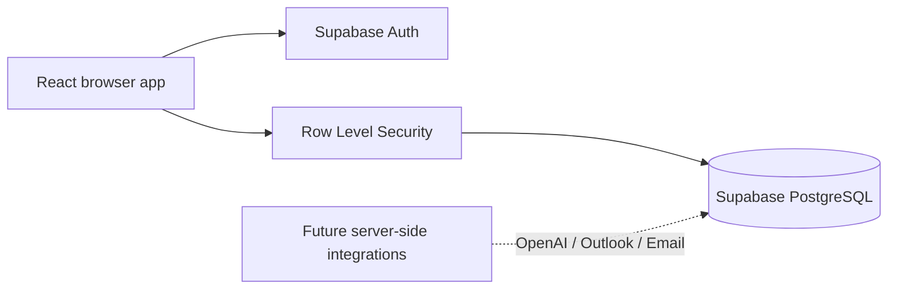

<div align="center">

# 🐾 Animal Rescue Adoption Platform

### A gentler, safer way to help people find the right companion.

React · TypeScript · Supabase · Accessible by design

[](#-current-status)
[](#-technology)
[](#-security-by-default)
[](#-quality-checks)

</div>

---

## ✨ The idea

Adoption is more than a search. It is a relationship between an animal, a person, and the life
they are ready to share.

This platform is being built for a Costa Rican rescue center to make that journey more thoughtful:

- applicants get a clear, welcoming path from first visit to future adoption;
- rescue staff get a secure workspace for the decisions that matter;
- compatibility is designed to be transparent and explainable;
- AI will assist with grounded information later, never replace human judgment.

## 🧭 Current status

The project currently delivers the secure MVP foundation plus the core applicant and staff workflows:

| Area                                      | Status             |
| ----------------------------------------- | ------------------ |
| React application shell                   | ✅ Ready           |
| Email/password authentication             | ✅ Ready           |
| Applicant and staff roles                 | ✅ Ready           |
| Protected navigation                      | ✅ Ready           |
| Supabase profile and role schema          | ✅ Ready           |
| Row Level Security policies               | ✅ Migration ready |
| Responsive public/applicant/staff layouts | ✅ Ready           |
| Animal management                         | ✅ Ready           |
| Questionnaire and compatibility matching  | ✅ Ready           |
| Adoption applications                     | ✅ Ready           |
| Appointment request records               | ✅ Ready           |
| Outlook/email delivery                    | 🔐 Credentials needed |
| Grounded AI assistant                     | 🔐 Edge Function setup needed |

## 🏗️ Architecture



The foundation keeps the browser intentionally small:

- public routes handle discovery and account entry;
- Supabase Auth owns credentials and sessions;
- PostgreSQL owns profile and role data;
- RLS is the authorization boundary, not hidden navigation;
- privileged keys never belong in browser-facing environment variables.

## 🧰 Technology

- **Frontend:** React 19, TypeScript, Vite, React Router
- **Data and identity:** Supabase Auth, PostgreSQL, Row Level Security
- **Validation:** Zod
- **Testing:** Vitest, React Testing Library, Playwright
- **Quality:** TypeScript strict mode, ESLint, Prettier, CI workflow

## 🚀 Quick start

### 1. Install dependencies

```bash
npm install
```

### 2. Configure public Supabase values

```bash
cp .env.example .env.local
```

Set these values in `.env.local`:

```bash
VITE_SUPABASE_URL=your-project-url
VITE_SUPABASE_PUBLISHABLE_KEY=your-publishable-key
```

Never add secret keys, OpenAI, email-provider, or calendar credentials to `VITE_` variables.

Apply the database migrations before using the workflows:

```bash
npx supabase login
npx supabase link --project-ref YOUR_PROJECT_REF
npx supabase db push
```

The second migration creates animal records, photo storage policies, questionnaires,
compatibility results, applications, appointments, notification records, and assistant
conversation storage. Staff provisioning remains trusted-only.

### 3. Start the app

```bash
npm run dev
```

Open the local URL printed by Vite.

## 🧪 Quality checks

```bash
npm run typecheck
npm run lint
npm run test
npm run test:policies
npm run build
npm run test:e2e
```

The browser suite runs public and responsive journeys immediately. Live applicant/staff journeys
require a configured Supabase test project and these environment variables:

```bash
E2E_SUPABASE_URL=your-test-project-url
E2E_STAFF_EMAIL=staff-test-email
E2E_STAFF_PASSWORD=staff-test-password
```

The static policy check verifies the migration and policy contracts. Full database policy
execution requires the Supabase CLI and a local or dedicated test project.

## 🔐 Security by default

The foundation is designed to fail closed:

- every authenticated user has an explicit `applicant` or `staff` role;
- self-registration can create applicants only;
- role assignments are not writable from the browser;
- direct URL access is protected by the same policy as navigation;
- profiles are limited to the current user through RLS;
- missing configuration, sessions, or roles do not grant access;
- API keys for future OpenAI, email, and calendar integrations stay server-side.

Read the database design in [`001_foundation.sql`](supabase/migrations/001_foundation.sql) and the
route contract in [`routes-and-access.md`](specs/001-mvp-foundation/contracts/routes-and-access.md).

## 🗺️ Routes in the foundation

| Route            | Access           | Purpose                   |
| ---------------- | ---------------- | ------------------------- |
| `/`              | Public           | Landing page              |
| `/auth/sign-in`  | Public           | Sign in                   |
| `/auth/register` | Public           | Applicant registration    |
| `/auth/recover`  | Public           | Password recovery         |
| `/auth/reset`    | Recovery session | Set a new password        |
| `/app`           | Applicant        | Applicant home shell      |
| `/app/account`   | Applicant        | Account settings          |
| `/app/questionnaire` | Applicant     | Adoption questionnaire    |
| `/app/recommendations` | Applicant  | Explainable matches      |
| `/app/applications` | Applicant      | Application status        |
| `/app/appointments` | Applicant      | Appointment requests      |
| `/app/assistant` | Applicant         | Grounded rescue assistant |
| `/staff`         | Staff            | Staff workspace shell     |
| `/staff/account` | Staff            | Staff account settings    |
| `/staff/animals` | Staff            | Animal records and photos |
| `/staff/applications` | Staff       | Application review        |
| `/staff/applicants` | Staff         | Applicant directory       |
| `/staff/appointments` | Staff      | Appointment management    |

## 📁 Project map

```text
src/
├── app/                 # Router, providers, route protection, error boundaries
├── components/          # Shared accessible UI and feedback states
├── features/auth/       # Registration, sign-in, recovery, sessions, roles
├── features/layout/     # Public, applicant, and staff shells
├── lib/config/          # Runtime configuration validation
├── lib/supabase/        # Browser client boundary
├── styles/              # Design tokens and responsive styles
└── types/               # Auth and route contracts

supabase/migrations/     # Versioned database schema and RLS policies
tests/                   # Unit, integration, policy, security, and E2E coverage
specs/001-mvp-foundation/ # Constitution, plan, contracts, and executable tasks
```

## 🧩 Roadmap

1. **Foundation** — authentication, roles, protected shell, and secure data boundaries.
2. **Animal management** — staff CRUD, photos, availability, health, behavior, and care data. ✅
3. **Questionnaire and matching** — conditional questions, deterministic eligibility, transparent
   compatibility scoring. ✅
4. **Applications and appointments** — staff review and appointment request/status records. ✅
5. **Grounded AI assistant** — verified animal records only through a Supabase Edge Function. 🔐
6. **External delivery** — configure Microsoft Graph/Outlook and a transactional email provider
   for live calendar synchronization and notifications. 🔐

### Enable the assistant

Keep the OpenAI credential in Supabase’s server-side secret store:

```bash
npx supabase secrets set OPENAI_API_KEY=your_openai_key
npx supabase secrets set OPENAI_MODEL=gpt-4o-mini
npx supabase functions deploy animal-assistant
```

The React app never receives this key. The Edge Function authenticates the caller, reads only
available animal records through Supabase, and sends a grounded prompt to the model.

## 🤝 Development principles

This project follows the [project constitution](.specify/memory/constitution.md). In short:

- keep the architecture simple;
- protect every data boundary;
- make matching explainable;
- keep adoption decisions human-controlled;
- ground AI in verified rescue records;
- test security behavior, not only happy paths;
- ship the platform in independently useful increments.

## 📚 Project documentation

- [Feature specification](specs/001-mvp-foundation/spec.md)
- [Implementation plan](specs/001-mvp-foundation/plan.md)
- [Data model](specs/001-mvp-foundation/data-model.md)
- [Runtime configuration contract](specs/001-mvp-foundation/contracts/configuration.md)
- [Quickstart validation guide](specs/001-mvp-foundation/quickstart.md)
- [Implementation tasks](specs/001-mvp-foundation/tasks.md)

<div align="center">

Made with care for rescue teams, adopters, and the animals waiting for home. 🐶 🐱

</div>
